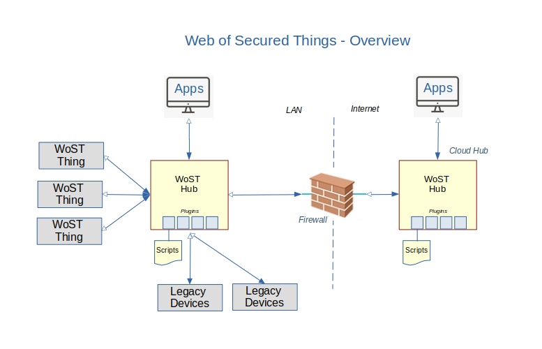
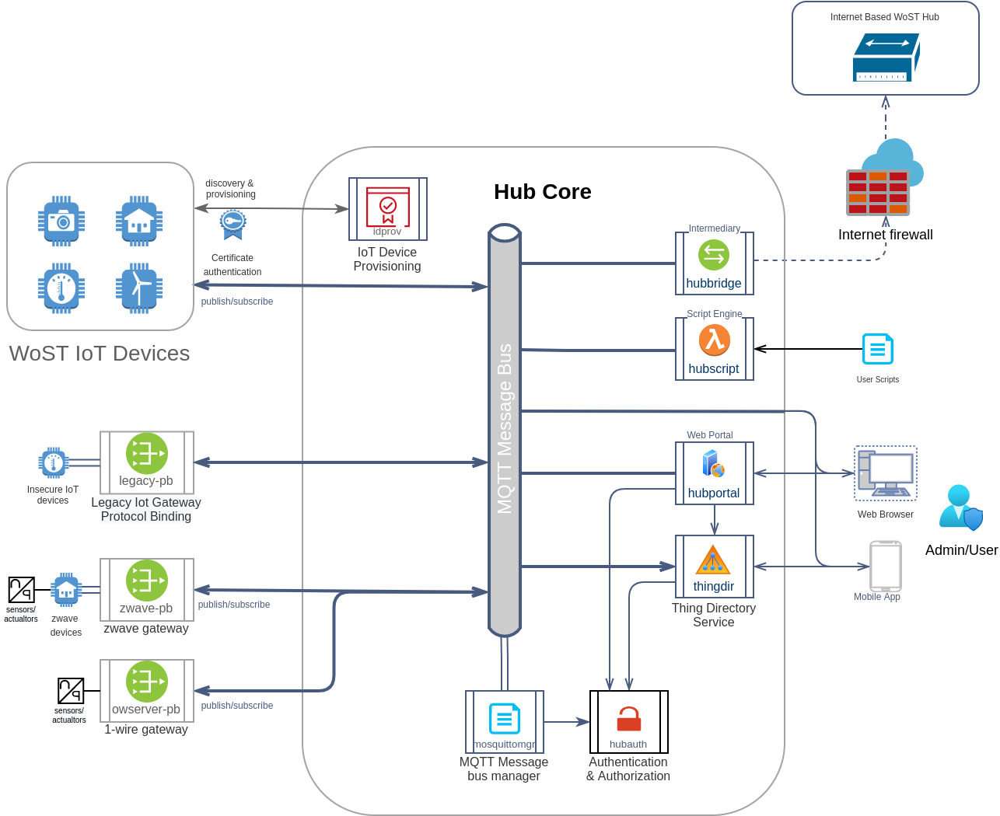

# WoST Zone - Web Of WoST Things - DRAFT

WoST is a language agnostic implementation of Web Of Things (WOT) with a focus on security, based on the 'Things Are NOT Servers' paradigm.

It aims to be WoT compliant while providing restrictions to establish a secured implementation of the WoT architecture.

## Objectives

The primary objective of this project is the creation of a secure approach to the Web of Things (WoT) while remaining compatible with the WoT architecture specifications. 

## Overview

WoST improves security in WoT simply by not allowing Things to expose a server, except when its purpose is to be a server. It aims to be WoT compliant except where this objective would be compromised.

It is the intent that 'WoST' compliancy will become a must have for the security minded consumer when purchasing IoT devices.

This approach requires the use of a hub to act on behalf of WoST Things. Rather than configuring each Thing, the configuration facility on the hub will let users manage the configuration. This hub-and-spokes approach is already quite common for existing IoT devices such as ZWave and Zigbee and does not seem to be a hindrance to adoption.

In the above diagram WoST Things and consumers connect to the hub which acts as a proxy for all Things. Data can flow back to the connecting devices. Hub plugins convert access to legacy devices as if they are  WoST Things.

All application interaction with WoST Things and legacy devices take place via the hub. Access over the internet is provided via a cloud intermediary, which can be another WoST hub run by a cloud service provider. 

## A Server On Every Device

With billions of IoT devices being used, and this number growing fast, the [WoT](https://www.w3.org/TR/?title=web%20of%20things) provides standards to support interoperability between IoT devices and its consumers. It addresses one of the biggest problems in IoT today.

However, there is an even bigger problem which is that of security of IoT devices.

WoT's [reference implementation](https://github.com/eclipse/thingweb.node-wot) implements a 'Thing' as a client and as a server. The problem is with running a server on every 'Thing'. This problem is commonplace and applies to the majority of devices.

A web server is a security risk, no matter how well written. If all 'WoT Things' implement a web server, the number of web servers would run in the many billions. Each server can potentially be hacked or used in denial of service attacks. Hardening a server for exposure to the Internet is difficult and requires constant vigilance and regular security patches. It is irresponsible to expose a server to the Internet without it. 

What are the chances of IoT device manufacturers to provide this level of security and support? If the past is any indication then the chances are nil [1]. A good example that even the best of intentions is not enough is that of CoAP. CoAP is lauded as one of the top IoT communication protocols of the future [2]. Unfortunately it is also vulnerable to so called DDOS reflection attacks [3]. A simple malformed message to a CoAP device results in a much larger message to a target address which is what DDOS attackers use to overload a web site. There is no fix (Dec 2020) and even if there was, who is going to update all these devices? ... The reality is that this won't happen. 

Okay you might say, but what about putting all these devices behind a firewall and use a gateway or 'intermediary' to connect to the Internet? This is certainly possible but no-where in the spec it says that 'Things' should not be connected to the Internet. In fact, the architecture shows several use-cases [4] where a remote controller connects to a 'Thing' from the Internet. While the WoT architecture specification is agnostic of how this connection takes place, the reference implementation interprets this as running a server on a Thing and requiring clients to connect to the Thing.

A related issue is that the LAN is not a safe place. A cross scripting attack can let a web site run a script on your browser that connects to your Thing unless the 'thing' is well protected against such attacks. Javascript running in your browser is already on the LAN and has already bypassed the firewall. The script can scan for devices on your LAN and potentially connect to them[5]. Imagine visiting a web site and suddenly your 'smart door lock' thing is controlled by someone else... In addition, viruses are well known for compromising PC's and can perform attacks on LAN based Things without browser restrictions.

As if these aren't enough risks, a lot of so-called smart devices today use UPnP or some tunneling solution to tell the Internet router to expose them to the Internet[6] so it seems common practice to do so. Various manuals explain how to turn on UPnP to control devices remotely [7]. 

The fact is that the moment you allow Internet access to a 'Thing', the convenience factor wins and you have lost control of the situation. Warnings that the situation is dire make the news regularly but there is little heed paid to these warnings. Many manufacturers, including (apparently) the WoT working group still see nothing wrong with running servers on IoT devices or do not actively work to discourage this as a viable option.

WoT security goal is that quote: ["devices should not be used in any form of attack"](https://www.w3.org/TR/wot-security/#wot-threat-model). However the architecture itself stays silent on how to achieve this. WoST argues that the WoT  should provide clear guidance in its architecture on securing Things so they can not be used in any form of attack, and bear responsibility for security vulnerabilities of said architecture. The challenge will be to appease its many masters when adding constraints to the architecture to elimitate security risks.

## The Security First Approach In WOST

WoST's paradigm is: 'Things Are Not Servers'. Securing servers is too difficult to expect all Thing manufacturers to do so dilligently. WoST requires that after provisioning a Thing MUST NOT act as a server, unless its purpose is to be a server. Note that this leaves the door open to run an insecure server just to provision the Thing.

WoST compliant 'Things' MUST adhere to simple but strict rules:
<code>
1. WoST Things MUST connect to their provisioned WoST Hub. The Hub will not connect to WoST Things.

2. WoST Things MUST NOT operate a server for the purpose of WoT after they are provisioned. It MUST NOT listen on any ports until it is unprovisioned by a factory reset.
   
   If the main purpose of the Thing is to be a server this functionality remains separate from the Thing functionality. Eg, a server is allowed for other purposes. For example, a web server can be monitored as a WoST Thing.

3. WoST Things MUST NOT request firewall ports to be opened using UPnP or any other means, including written instructions.

4. WoST Things MUST respect its user's privacy:

   WOST Things are only allowed to connect to the Internet to accomplish their primary purpose unless explicitly documented and approved by the user. 

   WoST Thing providers can provide an Internet based service that a Thing connects to after the user accepts the terms and MUST clearly identify what data is send to the service and how often.

   WoST Things should continue to operate without Internet connectivity for operations that are not dependent on an Internet connection.

   For example, sending usage data from a Thing to an Internet provider is not allowed until the administrator is informed about what data is sent, how often, and gives its consent.
</code>

The above set of rules reduces the number of servers greatly as only WoST Hubs run a server. At the same time it improves privacy. WoST Thing manufacturers benefit as they don't have to be as stringent about security, and less memory and CPU are needed on Things as no server is needed. Simpler and cheaper, what is not to like.

This raises an obvious question, how to connect to a Thing? The answer is that a consumer does not connect to a Thing. Instead, a consumer connects to the WoST Hub that a Thing is provisioned (paired) with. A Thing connects to its provisioned hub to send and receive messages while the connection is in place.

## WoST Hub

The primary purpose of a 'WoST Hub', or simply 'Hub', is to act as an intermediary for WoST Things. The Hub supports provisioning of Things, serves Thing TD's and relays actions and events that are defined in the TD. In addition the Hub can relay messages to cloud based intermediaries so that no direct LAN access is needed to view and control WoST Things from the Internet.

Hubs can be extended with plugins to also act as a hub for 3rd party IoT devices such as ZWave and one-wire, and for services such as a mDNS discovery, directory service and web server for user interaction. 

The burden of proper security lies therefore with the Hub. Hub providers must be committed to ensure their hubs are up to date with security patches, similar to Windows, Android devices or iPhones. While the risk doesn't disappear it is much more managable than requiring this for every single Thing itself.

### Hub Status & Roadmap

This project is in early development

**Core services** include services needed for regular operation of the Hub 

| name | description | status
|------|-------------|--------
| hub | Launcher and watchdog for hub plugins | Working Alpha
| hubauth | Centralized authentication and group role authorization to access Things | Working Alpha
| mosquittomgr | Manage the MQTT message bus using mosquitto | Working Alpha
| idprov-pb | Device provisioning service, providing client certificates and discovery for IoT devices | Working Alpha
| thingdir | Directory Service for registration and querying of Things | Working Alpha
| logger | Message logging for testing and troubleshooting | Working Alpha
| hubportal | Framework and widgets for configuration and interacting with things in a user interface | Todo
| hubbridge | Intermediary of select things to another hub, eg internet access | Todo
| hubscript | Scripting engine to run user scripts for automation | Todo

**Protocol Bindings**

Protocol bindings provide integration with existing IoT protocols.

| name | description | status
|-------|-------------|--------
| owserver-pb | 1-wire protocol adapter for 1-wire OWServer-V2 gateway | Working Alpha
| isy99-pb    | Insteon protocol adapter using isy99 gateway | todo
| zwave-pb | ZWave protocol adapter | todo
| ipcam    | Publish IP Camera images | todo
| weather  | Weather service protocol adapter | todo
| coap-pb | CoAP Protocol binding for CoAP devices on the local network | todo
| lora-pb | LoRa Protocol binding for LoRa gateway | todo
| phue-pb | Philips Hue protocol adapter |  todo
| notify-pb   | Notification protocol binding to send/receive notifications via email, text, twitter, ... | todo

**Enrichment Services**

Services provide value add services.

| name | description | status
|-------|-------------|--------
| ipnet    | Monitor the network and track changes | todo
| monit    | Monitor the status of computer | todo
| locator   | Location tracking of people and equipment |  todo
| energy   | Energy management analysis and reporting |  todo
| automate | Rule based automation  | todo

## WoST Compliance

In addition to being WoT compliant, WoST compliant Hubs MUST adhere to the following rules:
<code>
1. WoST Hubs MUST support provisioning of WoST Things. Rather obvious, but it is required.

2. WoST Hubs MUST relay events and actions between Things and their consumers as described in the TD.

3. WoST Hubs MUST have the ability for [post-manufacturing updates of itself, its scripts and its plugins](https://www.w3.org/TR/wot-architecture/#sec-security-consideration-update-provisioning). The authenticity of security updates MUST be verified before they are applied.

4. Commercial Hub Manufacturers MUST make security patches available for the duration of the support period of the Hub. The security update interval for minor to intermediate vulnerabilities MUST be 6 months or less. After being notified of a severe vulnerability, a security patch MUST be made available within one month of notification. (TODO, adhere to common definitions of minor, intermediate and severe vulnerabilities)

   Support for automatic updates of the firmware with security patches from a trusted source is STRONGLY recommended where possible. It MUST have the ability to disable automatic updates and use manual updates. 

5. WoST Hubs CAN implement a provisioning service that provisions the Thing device with discovery of WoST Hub endpoints. DNS-SD can be used for discovery of the provisioning server.

6. WoST Hubs CAN be configured to act as an intermediary and push selected Exposed Things to another Hub or intermediary. 

</code>

## WoST Hub Discovery and Provisioning

Discovery is a pre-curser to the provisioning step. WoST Hubs can be discovered by WoST Things and consumers manuall or through mDNS.

The provisioning server publishes a DNS-SD based discovery record for discovery on the local network. The provisioning server provides a directory of services that are available.

### DNS-SD
A WoST Hub MAY implement a [DNS-Based Service Discovery](https://www.w3.org/TR/2020/WD-wot-discovery-20201124/#introduction-dns-sd). Things and Thing consumers can use this to discover the hub on a local network. 

The provisioning service name of the WoST Hub follows the WoT Service Discovery naming. Tenatively "_idprov._tcp" with a TXT record containing the directory path. The default TXT record is: "path=/idprov/directory".

### Manual Discovery

WoST Things that do not support mDNS but do have a configuration file or utility, can be linked to the hub using the WoST Hub hostname or IP address.

### Thing Provisioning

Provisioning is the process of setting up a trusted relationship between the device that hosts the Thing and the WoST Hub. The process is initiated by a Thing device when it is unprovisioned and a hub is discovered. One of the methods described in the [OCF Security Specification](https://www.w3.org/TR/wot-security/#bib-ocf17) is used. Things with the ability to present an out of band secret can be provisioned securely without a leap of faith in the provisioning process.

Each WoST Thing MUST have an asymmetric private and public key for use in TLS connections. The preferred encryption key is EC P-256, an elliptic curve key format which the device generates on first use. During the provisioning process the public key is sent by the device to the provisioning server via a TLS encrypted endpoint. The provisioning server provides a client certificate after verification of the out of band secret along with a list of endpoints that support this certificate.

The WoST Hub verifies incoming connection with the CA that signed the client certificate. Thing devices can only connect with a valid client certificate. The certificate CN name is the device ID. This approach both ensures encryption and verifies authentication of the Thing device.

The provisioning process is described in detail in the [idprov standard](https://github.com/wostzone/idprov-standard) [10].

# References
[1] [Top 10 IoT security threats and vulnerabilities](https://blog.particle.io/the-top-10-iot-security-threats/)

[2] [CoAP](https://www.cse.wustl.edu/~jain/cse574-14/ftp/coap/)

[3] [FBI warns of new DDoS attack vectors: CoAP, WS-DD,...](https://www.zdnet.com/article/fbi-warns-of-new-ddos-attack-vectors-coap-ws-dd-arms-and-jenkins/)

[4] [WOT Architecture use-cases](https://www.w3.org/TR/wot-architecture/#remote-access)

[5] [Cross site scripting attacks](https://owasp.org/www-community/attacks/xss/)

[6] [UPnP a key threat to home IoT networks](https://securityledger.com/2019/03/devices-upnp-service-emerges-as-key-threat-to-home-iot-networks/) and [UPnP-enabled home devices](https://www.trendmicro.com/en_ca/research/19/c/upnp-enabled-connected-devices-in-home-unpatched-known-vulnerabilities.html)

[7] [Enabling UPnP for remote access](https://ltsecurityinc.zendesk.com/hc/en-us/articles/360008649453-How-to-enable-UPNP-to-perform-the-Port-Forwarding-without-accessing-the-router-)

[8] [OCF Security Specifications](https://www.w3.org/TR/wot-security/#bib-ocf17)

[9] [WoT Directory Service]((https://www.w3.org/TR/2020/WD-wot-discovery-20201124/#exploration-directory-api-registration))

[10] [IDProv standard](https://github.com/wostzone/idprov-standard)